<div align="center">



<br/>

<a href="https://github.com/Maneethvigneswarananbarasu">
  
</a>

<a href="https://www.linkedin.com/">
  
</a>

<a href="mailto:maneethvigneswaran1020@gmail.com">
  
</a>

</div>


## `> about_me`

```text
AI / Software Engineer focused on building practical AI systems.

I enjoy turning computer vision, LLMs and backend services
into applications that solve real-world problems.

Currently:
  → Building Campus-to-Career
  → Exploring LLM applications & AI agents
  → Improving Computer Vision systems
  → Preparing for entry-level AI / backend roles
```

## `> selected_work`

<table>
<tr>
<td width="50%" valign="top">

### 🚀 Campus-to-Career
**AI-Powered Placement & Assessment Platform**

`Python` `FastAPI` `LangChain` `Ollama`
`YOLOv8` `MediaPipe` `Redis` `PostgreSQL`

- AI-generated coding assessments
- Voice-based AI mock interviews
- Automated scoring
- Real-time AI proctoring
- Role-based placement portals

</td>
<td width="50%" valign="top">

### 🚑 SirenSight
**Emergency Vehicle Detection & Alert System**

`Python` `YOLOv8` `OpenCV` `TensorFlow`
`Firebase` `Android` `GPS`

- Ambulance detection
- Emergency sound classification
- GPS-based alerts
- Driver / Citizen / Police apps
- Firebase real-time synchronization

</td>
</tr>

<tr>
<td width="50%" valign="top">

### 🛡️ CrowdShield
**Context-Aware Crowd Safety**

`Kotlin` `Python` `Firebase` `FCM` `MQTT`

- Real-time safety alerts
- Android application
- Event simulation
- Push notifications
- MQTT communication

</td>
<td width="50%" valign="top">

### 🛣️ InfraGauge
**AI Infrastructure Monitoring**

`Python` `OpenCV` `Flask`
`PostgreSQL` `Open3D`

- Road damage processing
- Computer vision pipeline
- REST APIs
- Inspection result storage

</td>
</tr>
</table>

## `> tech_stack`

<div align="center">


<br/><br/>


</div>

## `> currently_learning`

```text
[████████████████░░░░] AI Agents
[███████████████░░░░░] RAG & LLM Evaluation
[████████████████░░░░] Computer Vision
[██████████████░░░░░░] Production AI
```

## `> github_activity`

<div align="center">


</div>

<div align="center">


</div>

## `> contribution_map`

<div align="center">


</div>

## `> career_focus`

```text
AI Engineer
Computer Vision Engineer
Python Backend Developer
Generative AI / LLM Applications
```

## `> connect`

<div align="center">

📍 Chennai, India

📧 [maneethvigneswaran1020@gmail.com](mailto:maneethvigneswaran1020@gmail.com)

🔗 [LinkedIn](https://www.linkedin.com/)

</div>


<div align="center">

```text
BUILD → TEST → LEARN → IMPROVE → REPEAT
```

⭐ Thanks for visiting my profile.

</div>
